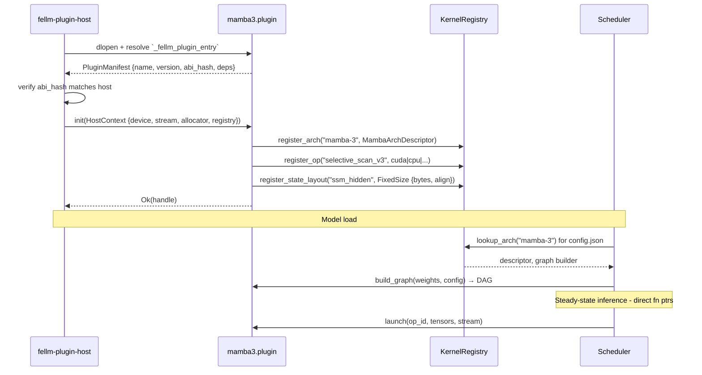
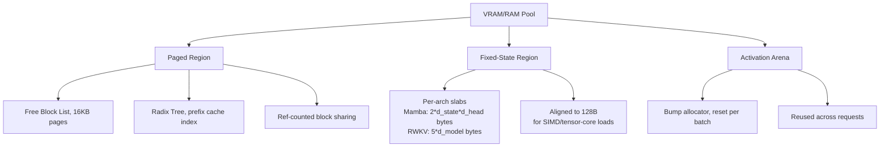
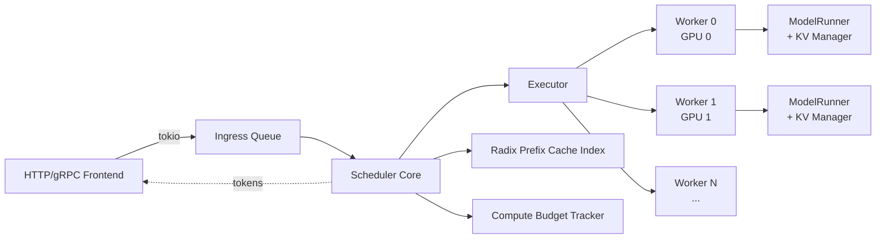

# FeLLM Architecture Document

**A Hybrid Rust-Native Inference Engine for the Post-Transformer Era (2026+)**

*Version 0.1 - Design Document*
*Prepared for: oriel*
*Toolchain baseline: Rust 1.96 stable, Cargo workspaces*

---

## Part I - Vision, Positioning, and Non-Goals

### 1.1 The problem statement

The LLM inference landscape in mid-2026 is fractured across three archetypes, each with a fatal flaw for what comes next:

**llama.cpp** delivers extraordinary edge performance and quantization variety (GGUF k-quants, i-quants, imatrix calibration), and its `ggml` backend abstraction is a genuine achievement. But its C/C++ core, hard-coded operator graph, and Transformer-centric assumptions make every new architecture (Mamba, hybrid SSM, block-diffusion) a multi-month integration project. Adding a new backend means threading conditional compilation and dispatch through hundreds of files.

**vLLM** delivers unmatched throughput via PagedAttention, continuous batching, prefix caching, chunked prefill, prefill/decode disaggregation, and (in V1) a clean multi-process executor/worker/model-runner architecture. But it is Python-first with CUDA-first assumptions. Cold start is slow, memory footprint is heavy, and the "engine that runs on a laptop and a DGX equally well" is not vLLM's identity. Its plugin story is import-based Python modules, not a stable ABI.

**mistral.rs, Candle, Burn/CubeCL** prove Rust can play in this space. Candle is minimalist; Burn+CubeCL has a real JIT-compiled kernel framework that runs on CUDA, ROCm/HIP, WGPU, and CPU with fused ops; mistral.rs already ships day-0 support for many models. None of them, however, are architected around the *hybrid* future - where a single model may interleave attention layers, Mamba-3 SSM blocks, MoE routing, and block-diffusion decoding, all requiring different KV/state layouts, different scheduling regimes, and different kernels.

Meanwhile the model side has moved decisively:

- **Mamba-3** (arXiv 2603.15569, ICLR 2026) is explicitly an *inference-first* redesign of SSMs, using generalized SSM formulations, multi-input/multi-output variants (MIMO/MVA), QK-Norm on the B/C projections, and a state-passing recurrence that eliminates KV growth entirely. Together AI's blog frames it as targeting the "memory-bandwidth wall" that transformers hit at long context.
- **DiffusionGemma** (Google, June 2026) - a 26B / 4B-active MoE built on the Gemma-4 backbone that generates via *discrete diffusion*, unmasking blocks of tokens in parallel rounds. Native support arrived in vLLM by re-architecting the decoding loop away from strict left-to-right.
- **Nemotron-TwoTower** (NVIDIA, late 2025 / early 2026) - a block-wise autoregressive *diffusion* model with two 52-layer towers over a Mamba-2 + attention + MoE hybrid backbone, achieving ~2.4× wall-clock speedup at ~98.7% quality.
- **DeepSeek V3/V4, GLM-5.x, Kimi K2.x, Qwen3.6** all use aggressive MoE (fine-grained expert routing, hundreds of experts, low activation ratios like 30B-A3B), and DeepSeek-family models now train and infer with **Multi-Token Prediction (MTP)** heads.
- **Hybrid stacks** (Jamba, Zamba, Nemotron-H, Falcon-H) interleave attention with linear/SSM layers.
- **Test-time compute / reasoning-budget** is now a first-class serving concern, not an application-layer trick.

### 1.2 Vision for FeLLM

FeLLM is a **Rust-native, backend-folded, plugin-extensible inference engine** designed so that:

1. **Edge performance rivals llama.cpp** on a Raspberry Pi 5, a MacBook, or a Ryzen laptop with an iGPU - because the CPU/SIMD path is not an afterthought, quantization is first-class, and the binary has no Python runtime.
2. **Serving throughput rivals vLLM/SGLang** on 1×H100, 8×H200, or a Blackwell node - because PagedAttention, continuous batching, chunked prefill, prefix caching (radix-tree), speculative decoding, MTP, and prefill/decode disaggregation are core scheduler primitives, not bolt-ons.
3. **New architectures ship as plugins in hours, not months** - the operator graph is dynamic, the kernel registry is dynamic, and adding "Mamba-3" or "DiffusionGemma-style block decoding" is a matter of dropping a `.so`/`.dylib`/`.dll` into `plugins/` (or statically linking a crate) that registers its ops.
4. **The backend is chosen at compile time** - you get one crisp binary: `fellm-cuda`, `fellm-rocm`, `fellm-vulkan`, `fellm-metal`, `fellm-cpu`. There is no runtime `if cuda { ... } else if rocm { ... }` dispatch outside the kernel registry. Only the backend you compile in exists in the binary.

### 1.3 Explicit non-goals

FeLLM does not try to be a training framework. It does not try to be a model zoo. It does not try to abstract over 20 hardware vendors at runtime - that road leads to `ggml`'s coordination cost. It does not embed Python. It does not ship its own tokenizer training pipeline. It is an **inference engine and serving runtime**, period.

---

## Part II - The Backend-Folding Compile Model

### 2.1 The core insight

Adopting `wgpu` or CubeCL-style *runtime dispatch across all backends* is tempting because it lets one binary run anywhere. But it costs binary size, cold-start latency, and - most importantly - it prevents backend-specific optimizations like **cuda-oxide PTX kernels that only exist for NVIDIA**, or Metal Performance Shaders on Apple Silicon, or ROCm `rocwmma` intrinsics for RDNA/CDNA.

FeLLM inverts this. **Backend selection is a compile-time Cargo feature that folds the entire dependency graph.** Only one hardware backend is present in a given binary. The consequence: `rustc` performs aggressive LTO, inlines cross-crate calls, monomorphizes kernel dispatch to direct function pointers, and produces a binary the size of llama.cpp - not the size of PyTorch.

### 2.2 The workspace layout

```
fellm/
├── Cargo.toml                        # virtual workspace
├── crates/
│   ├── fellm-core/                   # tensors, dtypes, graph IR, scheduler-neutral traits
│   ├── fellm-runtime/                # executor, scheduler, batching, KV/state managers
│   ├── fellm-model/                  # model loader (GGUF, Safetensors), weight streaming
│   ├── fellm-tokenizer/              # BPE/SentencePiece/tiktoken-compatible tokenizer
│   ├── fellm-sampler/                # sampling, structured decoding (llguidance/xgrammar)
│   ├── fellm-server/                 # HTTP/gRPC, OpenAI-compatible API
│   ├── fellm-plugin-abi/             # the stable FFI contract for plugins (abi_stable)
│   ├── fellm-plugin-host/            # dynamic loading, version negotiation, sandboxing
│   │
│   ├── backend-cpu/                  # SIMD kernels (AVX2/AVX-512/NEON/SVE), pthreads
│   ├── backend-cuda/                 # cuda-oxide kernels + cuBLAS/cuDNN bindings
│   ├── backend-rocm/                 # HIP via rocm-rs/cubecl-hip-sys, rocBLAS/hipBLASLt
│   ├── backend-vulkan/               # wgpu compute + SPIR-V kernels (rust-gpu / naga)
│   ├── backend-metal/                # metal-rs + MSL kernels (Apple Silicon)
│   │
│   └── ops/                          # per-architecture operator crates (statically linkable)
│       ├── ops-transformer/          # attention, RoPE, RMSNorm, MoE routing
│       ├── ops-mamba3/               # selective scan, MVA, QK-Norm on B/C, state update
│       ├── ops-diffusion/            # discrete-diffusion unmasking, block scheduling
│       └── ops-twotower/             # two-tower AR-diffusion context/generation split
│
└── plugins/                          # runtime-loaded .so/.dylib/.dll, one per architecture
    ├── mamba3.plugin
    ├── diffusion-gemma.plugin
    └── twotower.plugin
```

### 2.3 Feature-driven compilation

The top-level `fellm` binary crate declares Cargo features that are **mutually exclusive on the backend axis**:

- `backend-cpu` - always available, fallback and edge target.
- `backend-cuda` - pulls in `backend-cuda` crate, `cuda-oxide`, and enables `#[cfg(feature = "cuda")]` code paths across `fellm-runtime` (e.g., CUDA stream management in the scheduler).
- `backend-rocm`, `backend-vulkan`, `backend-metal` - analogous.

Because features are additive and the backend crates are `#[cfg]`-gated at the crate level, `rustc` never sees the CUDA code when compiling for CPU-only edge, and the `cuda_oxide` toolchain requirement is completely absent. LTO then flattens the remaining code.

### 2.4 What "folding" means concretely

At compile time, `fellm-runtime` calls into a single trait implementation for its device operations, resolved statically:

- The `Device`, `Stream`, `Buffer`, and `KernelRegistry` types are trait objects *only at the plugin boundary*. Inside the compiled core, they are concrete types injected by the selected backend crate.
- The main hot loops (batching scheduler, sampler, KV-cache block allocator) are generic over a `Backend: 'static` trait, monomorphized once at build time for the selected backend.
- Only *plugin* operator dispatch is dynamic - and even there, it is a direct function pointer through the stable ABI, not a `HashMap` lookup per call.

This is the core insight that gives FeLLM llama.cpp-class edge performance: **the plugin abstraction only pays its cost at operator boundaries within a model layer, not inside inner loops.**

---

## Part III - The Plugin System

### 3.1 Two plugin planes

FeLLM distinguishes two orthogonal extension surfaces:

**Architecture plugins** - an entire model family. A Mamba-3 plugin knows how to interpret model config, produce a computation graph, own its state layout, hook into the KV/state manager, and consume tokens through the scheduler. Adding Mamba-3 to a shipped FeLLM binary means dropping `mamba3.plugin` in `plugins/`.

**Operator/kernel plugins** - a single op implementation (e.g., a faster fused RMSNorm+RoPE for a specific GPU). These register into the `KernelRegistry` keyed by `(op_signature, backend, dtype, shape_constraints)` and the graph executor picks the best-scoring impl at graph-compile time.

Architecture plugins declare the ops they need. Operator plugins declare what they provide. Matching happens at model load, not per token.

### 3.2 The ABI boundary

Rust's ABI is unstable across compiler versions. Rust dylibs cross-compiled with a different rustc than the host `fellm` binary will crash. FeLLM solves this with a two-layer approach:

**Layer 1 - `abi_stable` for high-level Rust-to-Rust FFI.** The `fellm-plugin-abi` crate defines all cross-plugin types with `#[sabi_trait]` and `#[repr(C)]` via `abi_stable`. This includes the plugin's registration trait, the operator descriptor structs, tensor handles, and error types. `abi_stable` does load-time type-layout checking, so an ABI-incompatible plugin fails cleanly at load rather than segfaulting mid-inference.

**Layer 2 - a hard C ABI for kernel launch.** For the actual per-op hot path (launching a kernel, reading a tensor), the boundary drops to `extern "C"` with `#[repr(C)]` structs of fixed layout: shape as `[i64; 8]` with rank counter, strides likewise, `dtype: u32`, opaque `device_ptr: *mut c_void`, and a `stream_handle: u64`. This is what actually flows through `libloading`-resolved function pointers.

The rationale for splitting the two: `abi_stable` gives us versioned, checked, ergonomic Rust registration APIs; the C-ABI kernel launch path gives us zero-overhead invocation at the frequency-sensitive point.

### 3.3 Plugin lifecycle



### 3.4 Shared context: no memory copies across the boundary

A dynamic plugin runs its kernels on the **same** CUDA context and stream as the core. When the plugin registers, the host passes:

- A raw `CUcontext` / `hipCtx_t` / `MTLDevice` handle (as `u64` for ABI stability).
- A stream handle for the current work.
- A pointer to the host-owned allocator (the paged KV allocator, described in Part V) so the plugin's temporary buffers come from the same VRAM pool.

Consequence: launching a plugin kernel and a core kernel back-to-back involves zero `cudaMemcpy`, zero context switches, and no synchronization beyond the stream ordering the host already manages. This is the design that lets Mamba-3's `selective_scan` fuse cleanly with a preceding RMSNorm even though they live in different `.so` files.

### 3.5 Safety and sandbox posture

Plugins are trusted code, like Postgres extensions or Neovim Lua plugins - you install them explicitly. FeLLM does not sandbox them (that would defeat zero-copy). What it *does* enforce:

- ABI hash check on load, refusing plugins built against an incompatible `fellm-plugin-abi` version.
- Symbol allowlist: the plugin can only see functions the host explicitly exposes via the `HostContext` vtable, not the host binary's full symbol table.
- Panic isolation: every FFI entry point wraps in `std::panic::catch_unwind` so a plugin bug doesn't unwind through C frames into UB.
- Per-plugin resource accounting (VRAM, thread count) reported to the host for telemetry and OOM triage.

---

## Part IV - The Execution Graph and Runtime

### 4.1 Model loading produces an operator DAG

FeLLM does not have a hardcoded "Llama forward pass" function. When a model loads (from GGUF, safetensors, or a native FeLLM format), the model loader:

1. Reads the config to identify the architecture identifier (`llama`, `mamba-3`, `diffusion-gemma`, `twotower-nemotron`, `jamba-hybrid`).
2. Asks the plugin/arch registry for a `GraphBuilder` for that architecture.
3. The `GraphBuilder` emits a **typed DAG** of `OpNode`s. Each `OpNode` has an op-signature (e.g., `rmsnorm.f16`, `rope.f16`, `paged_attn.f16.q4_km`, `mamba3_scan.f16.state_fixed`), input/output tensor shapes, and metadata (e.g., "this op produces KV cache blocks", "this op consumes SSM state").
4. The `KernelRegistry` resolves each `OpNode` to a concrete kernel function pointer for the compiled backend, selecting from multiple candidates by cost model (bandwidth, occupancy, shape fit).
5. The graph is passed to a **graph optimizer** that fuses adjacent ops where possible (RMSNorm+Linear, RoPE+QKV projection, sigmoid+silu gate, Mamba's conv1d+state-update), inserts reshape ops where layouts differ, and marks memory-lifetime intervals for the allocator.

### 4.2 Automatic fallback

If the CUDA backend has no kernel for `mamba3_scan.bf16.state_fixed` but the CPU backend does, the graph resolver marks that op for CPU execution. The scheduler inserts an implicit `d2h → cpu op → h2d` around it. This is a **planning-time** decision, not runtime dispatch - the resulting graph has explicit transfer nodes and the executor treats them like any other op. A warning is logged so the user knows they're on a slow path.

### 4.3 The execution loop is not a token loop

Traditional inference loops are: `while not eos: forward(); sample(); append();`. That model breaks for:

- **DiffusionGemma / block-diffusion models**, which emit N tokens per denoising round via M rounds. The loop is `for round in 0..M: denoise_block(); update_mask();`.
- **Nemotron-TwoTower**, which pipelines a context tower and a generation tower with distinct schedules.
- **Reasoning models with test-time compute budgets**, which may internally do rollouts, best-of-N, tree search, or self-consistency before emitting a single visible token.
- **MTP (Multi-Token Prediction)**, where the primary decode step produces 2–4 candidate future tokens that must be verified in the next forward pass.
- **Speculative decoding (EAGLE-3, Medusa-V2, PARD, N-gram, draft models)**, which propose a batch of speculative tokens and roll back on divergence.

The FeLLM execution loop is instead a **generator-of-tokens abstraction** owned by the architecture plugin. The core exposes:

```
trait TokenProducer {
    fn step(&mut self, ctx: &mut StepCtx) -> StepResult;
}

enum StepResult {
    Emit(TokenBatch),           // publish one or more tokens
    NeedForward(GraphInvocation), // ask the executor to run a subgraph
    NeedCompute(BudgetRequest),   // reasoning budget: give me K more forwards
    Done,
}
```

The scheduler pulls `step()` in a loop, dispatches whatever the producer asks for, and hands the result back. This uniform abstraction lets speculative decoding, MTP, block-diffusion, and reasoning-budget loops all coexist without special-casing the core.

### 4.4 Test-time compute as a first-class citizen

The scheduler treats every request as having a **compute budget** - a soft cap on the number of forward passes (or FLOPs) the request may consume before emitting a token. Requests declare their budget at admission (from an API parameter like `reasoning_effort` or `max_thinking_tokens`). The scheduler:

- Tracks per-request cumulative compute.
- Interleaves reasoning-budget-heavy requests with cheap ones for latency SLO preservation.
- Emits a stream of `thinking` tokens (hidden or exposed via API) so the client can display progress.
- Can preempt a runaway reasoning loop and force emission if latency SLO is breached.

This is what lets FeLLM serve OpenAI-style `reasoning_effort=high` alongside plain chat completions on the same instance without one starving the other.

---

## Part V - Hybrid State and Cache Management

### 5.1 Two memory regimes, one allocator

The engine must manage two profoundly different memory patterns simultaneously:

**Paged (Attention KV cache).** Grows with context length. Highly fragmented across concurrent requests. Benefits from block-level sharing across requests with common prefixes (prefix caching). This is the domain of PagedAttention.

**Fixed-size (SSM / Mamba hidden state, RWKV state, linear-attention state).** Does not grow with context length - the state size is `d_state × d_head × n_heads`, period. But it must be tightly aligned to the vector width of the target hardware (for Mamba-3, the state update wants to live in SRAM/L2 during the scan) and it *is* per-request.

FeLLM ships a unified allocator that manages both:



### 5.2 PagedAttention with prefix-caching radix tree

The paged region is organized as fixed-size blocks (16 tokens each, `2 × n_kv_heads × head_dim × block_size × dtype_bytes` per layer). A logical-to-physical block table maps each request's KV cache to its blocks. Blocks are ref-counted; a `fork` on a shared prompt only bumps refcounts.

Prefix caching uses a **radix tree** (à la SGLang's RadixAttention) keyed on token sequences. When a new request arrives, the scheduler walks the tree with the request's prompt, matching the longest existing prefix and pointing the request at those blocks for free. Eviction is LRU with reference-count guard.

### 5.3 Fixed-state region for SSM

At model load, the architecture plugin declares:

```
StateLayout {
    per_layer_bytes: usize,
    align: usize,             // 128 or 256 for tensor-core alignment
    variant: StateVariant::FixedRecurrent,
    initializer: Option<InitFn>,  // e.g., zero, or learned
}
```

The allocator slabs these into contiguous per-request arenas so that the entire per-layer state is in one cache-friendly stride. For Mamba-3 specifically, the state layout is chosen so that the selective-scan kernel can keep the state resident in shared memory / L1 during a batch's scan step, matching what the reference CUDA kernel does.

### 5.4 Hybrid models

For models like Jamba, Zamba, Nemotron-H, Falcon-H, and the two-tower Nemotron backbone - which interleave attention and SSM/linear layers - the allocator serves both regions for the same request. The graph nodes carry their memory-region tag, so an attention layer allocates from paged region and the following Mamba layer allocates from fixed-state region without any manual intervention.

### 5.5 CPU/RAM/disk offloading tiers

For edge devices and low-VRAM inference, FeLLM implements a tiered memory hierarchy:

- Tier 0 - device (VRAM or CPU cache-hot RAM).
- Tier 1 - host RAM (for GPU: pinned host memory, DMA-mapped).
- Tier 2 - NVMe (mmap'd with `MADV_RANDOM` on prefetch heuristics).

Layer weights, expert weights (for MoE), and cold KV blocks migrate across tiers under an LRU-with-hint policy. The MoE case is especially important: with a 30B-A3B model, only ~3B parameters are hot at any moment, and expert weights can live on NVMe with just a handful of active experts pinned to VRAM. This is what makes running Kimi K2.6 or DiffusionGemma on a single consumer GPU actually feasible.

---

## Part VI - Kernel Story per Backend

### 6.1 CUDA backend - the cuda-oxide bet

FeLLM's CUDA kernels are written in **pure Rust** using cuda-oxide (v0.2+ as of mid-2026), NVIDIA's official Rust-to-PTX compiler. Kernels are annotated `#[kernel]` inside a `#[cuda_module]`, and cuda-oxide's custom rustc codegen backend compiles them directly to PTX. The generated `kernels::load(&ctx)` function returns type-checked launchers.

The bet here is deliberate. Rust-CUDA (the older Rust-GPU project) is more mature but is a community project. cuda-oxide is NVIDIA-official and its trajectory is toward stability. FeLLM depends on the **cuda-oxide public API**, not internal MIR shapes, so the risk is bounded.

For kernels where cuda-oxide is not yet production-ready (currently: WMMA/tensor-core-heavy paths like FlashAttention-4-class attention on Blackwell), FeLLM falls back to two escape hatches:

- **cuBLASLt / cuDNN / cuBLAS FFI** through hand-written `-sys` bindings for large GEMMs, batched GEMMs, and provided attention.
- **Pre-built PTX assets** for the most performance-critical hand-tuned kernels (attention, MoE grouped GEMM), loaded via `cuModuleLoadData`. This is the same escape valve llama.cpp uses.

The philosophy: **cuda-oxide for the 80% of kernels that are memory-bound or compute-moderate, vendor libraries for the 20% that must extract every last flop from tensor cores.**

### 6.2 ROCm backend

Backed by `rocm-rs` (safe wrappers) and `cubecl-hip-sys` (raw bindings) against ROCm 7.x. Compute kernels are written in CubeCL when portability with CUDA is desired, or in HIP C++ (via a build script) for a handful of hot paths that need `rocwmma` intrinsics.

### 6.3 Vulkan/WGPU backend

For portability - Intel iGPUs, AMD consumer cards on non-ROCm platforms, mobile GPUs, WebGPU browsers, and anywhere else a Vulkan driver exists. Backed by `wgpu` with kernels written in WGSL (potentially generated from a common CubeCL source) and dispatched through `naga` to SPIR-V. This is the same backend approach `wgpu-llm` and `aether` have demonstrated works.

### 6.4 Metal backend

Backed by `metal-rs` for Apple Silicon (M1–M4+). Kernels in MSL, with FFI to Metal Performance Shaders for GEMM. Metal shares unified memory with the CPU, so the allocator collapses paged/fixed-state regions into one system RAM pool with different alignment tags. This is where FeLLM competes directly with llama.cpp on MacBooks - and the shared-context-across-plugins design pays off because a Mamba-3 plugin's kernel touches the same buffers as the RMSNorm before it, with zero copies.

### 6.5 CPU backend

The unglamorous but critical backend. Kernels use:

- `std::simd` (portable_simd) for the common cases - with Rust 1.96 the story is stable enough for production, and it lowers to AVX2, AVX-512 (including AVX10 on newer chips), NEON, and SVE.
- Runtime CPU-feature detection at startup, with the appropriate SIMD-width specialization chosen once.
- Multi-threaded op-level parallelism via `rayon` for embarassingly parallel ops and a work-stealing dedicated pool for GEMM tiles.
- Explicit prefetch hints and cache-line-aligned tensor layouts.
- Direct support for GGUF k-quants (Q4_K_M, Q5_K_M, Q6_K, Q8_0, IQ2_XS, IQ3_XXS, etc.) with unpacking done inside the matmul microkernel, matching llama.cpp's approach.

### 6.6 Quantization support matrix

FeLLM ships day-one support for the formats that matter in mid-2026:

- **GGUF** (llama.cpp k-quants + i-quants + imatrix): for edge and CPU-first workloads.
- **AWQ** (activation-aware INT4): the current sweet-spot for INT4 GPU serving at near-lossless quality.
- **GPTQ** (INT4/INT8, legacy but ubiquitous).
- **NVFP4** (Blackwell-native 4-bit floating point via NVIDIA's format): the emerging default for H200/B200-class serving.
- **FP8** (E4M3/E5M2, Hopper+): both weights and KV cache.
- **Bitsandbytes** NF4/FP4 (for QLoRA-fine-tuned models).

Quantization support is a **crate-level feature** (`quant-gguf`, `quant-awq`, `quant-nvfp4`, ...) so edge builds that only need GGUF don't drag in the AWQ/GPTQ deserializers.

---

## Part VII - Scheduler and Serving Layer

### 7.1 The batching architecture

FeLLM adopts a **multi-process, vLLM-V1-inspired executor/worker model** with Rust-native ergonomics:



The **Scheduler Core** runs on the main process. On every scheduling tick (default 1 ms, configurable), it:

1. Admits new requests from the ingress queue, matching them against the radix prefix cache.
2. Selects a batch: mixing prefill and decode requests via chunked-prefill (bounded prefill token count per step), or dispatching them to disaggregated prefill/decode pools if configured.
3. Applies fair-share among tenants, respecting compute budgets and latency SLOs.
4. Sends a `SchedulerOutput` (the concrete list of requests, tokens, KV block table diffs) to the Executor.
5. Receives sampled tokens back and pushes them to the frontend streams.

The **Executor** owns worker processes (one per GPU for tensor-parallel; multiple stages for pipeline-parallel). Communication between scheduler and executor is over shared-memory ring buffers for the hot path and `tokio` channels for control.

Each **Worker** runs a **ModelRunner** - the concrete graph executor for its model shard. The ModelRunner is where the compiled backend actually launches kernels.

### 7.2 Continuous batching, chunked prefill, prefill/decode disaggregation

All three are native scheduler modes, selectable per deployment:

- **Continuous batching** - default. New requests join the running batch on the next step. Decode-heavy workloads see 2–10× throughput over static batching.
- **Chunked prefill** - long prompts are sliced into chunks (e.g., 512 tokens) so they don't monopolize a step and starve decode-phase requests. This dramatically improves ITL (inter-token latency) tail under mixed loads.
- **Disaggregated prefill/decode** - for large deployments, prefill runs on one pool of workers and decode on another, connected by KV cache transfer over NVLink/RDMA. This lets prefill-heavy and decode-heavy hardware be provisioned independently, following the DistServe / vLLM disagg pattern.

### 7.3 Speculative decoding and MTP

The `TokenProducer` abstraction from Part IV lets these plug in cleanly:

- **Draft-model speculative decoding**: two `ModelRunner`s share the scheduler, the small one proposes K tokens, the large one verifies in one forward pass. On divergence, the diverged suffix is discarded and only the accepted prefix is committed. FeLLM ships adapters for EAGLE-3 (feature-level extrapolation with a single transformer layer as the drafter) and Medusa-V2 (multiple decoding heads on the target model itself) and PARD.
- **N-gram speculation**: a lookup-table drafter with zero model overhead, best for repetitive/structured outputs.
- **MTP**: DeepSeek V3/V4-style, GLM-5.1-style - where the model itself produces multiple future-token predictions per step via extra prediction heads. The scheduler batches K tokens per step by default. On mispredict, it rolls back exactly as with speculative decoding, but no drafter model is needed.

The core observes 2–3× speedup in the good case, breaks even in the worst case, and never sacrifices output distribution correctness.

### 7.4 Structured output

Grammar-constrained decoding is integrated at the sampler level using **llguidance** (fast token-mask generation via lexer+earley parser) with **xgrammar**-style batched PDA fallback for very tight constraints. Both compile a JSON Schema / regex / lark grammar to a token-level FSM. The sampler applies the FSM mask before the softmax, so constrained outputs are essentially free - grammar mask generation overlaps with the GPU forward pass.

### 7.5 LoRA and adapter hot-swap

LoRA adapters are supported as first-class runtime attachments. The scheduler routes requests to their attached adapter by name; adapters are batched together via the S-LoRA / Punica-style grouped-GEMM path. Hot-swap in and out at runtime; the LoRA weights live in a dedicated slab of the allocator.

### 7.6 Distributed serving

- **Tensor parallelism** across GPUs on one node via NCCL/RCCL, with a Megatron-LM-style row/column sharding of linear layers.
- **Pipeline parallelism** across nodes for very large models, using microbatching.
- **Expert parallelism** for MoE - experts sharded across GPUs, with all-to-all dispatch/combine collectives, following the Hybrid-EP pattern NVIDIA published for Megatron.
- **Data parallelism** at the serving level: multiple identical replicas behind the frontend load balancer.

---

## Part VIII - Model Format and Loading

### 8.1 Supported input formats

- **GGUF** - first-class. GGUF is the de facto edge format and its metadata model (arbitrary key-value pairs) is a good fit for architecture plugins to inject their own metadata.
- **safetensors** - first-class. The Hugging Face default. Loader reads the JSON header, memory-maps the tensor data, and streams weights into device buffers with zero heap allocations.
- **A native FeLLM format** (`.fellm`) - an optional archive format that bundles safetensors weights, a canonical config, tokenizer, and an optional precompiled graph. Cold-start optimized. Not required, but faster.

### 8.2 Architecture identification

Model config carries a `model_type` string (`llama`, `mamba`, `mamba3`, `diffusion_gemma`, `nemotron_h`, `jamba`, `twotower_nemotron`, `qwen3`, ...). The plugin registry maps that string to a `GraphBuilder`. If no plugin claims the architecture, load fails with a clear message listing what plugins would be needed.

### 8.3 Tokenizer

- BPE (byte-pair) with a **tiktoken-compatible** fast path (single-text encode benchmarks ~3-4× faster than Python `tiktoken` when written natively in Rust).
- SentencePiece unigram and BPE, byte-fallback support.
- Chat template execution using a small Jinja2-compatible template engine (only the subset needed for chat templates: for/if/set/filters).

Tokenizer artifacts (vocabs, merges, added tokens, chat templates) are embedded in GGUF or shipped as `tokenizer.json` (Hugging Face format) - both loaders present the same API.

---

## Part IX - API Surface

### 9.1 Server API

- **OpenAI-compatible HTTP** - `/v1/chat/completions`, `/v1/completions`, `/v1/embeddings`, `/v1/models`, streaming via SSE. This is what makes FeLLM a drop-in replacement in existing deployments.
- **Native gRPC** - a lower-latency binary protocol for high-throughput first-party clients, exposing scheduler-native features (batch submit, per-request compute budget, structured output schemas).
- **Metrics** - Prometheus exposition of scheduler counters (queue depth, ITL histograms, prefix-cache hit rate, VRAM utilization, expert activation heatmap for MoE).

### 9.2 Embedded (library) API

FeLLM ships as both a binary and a Rust library. Embedding it in another Rust app looks like:

```
let engine = Engine::builder()
    .model("path/to/model.gguf")
    .backend(Backend::detected()) // compiled backend
    .max_batch_tokens(8192)
    .prefix_cache(true)
    .build()?;

let stream = engine.chat(messages, GenParams { reasoning_effort: 0.5, ... }).await?;
while let Some(tok) = stream.next().await { ... }
```

This is the mistral.rs-style embed pattern, cleaned up for the plugin-first world.

---

## Part X - Roadmap and Sequencing

**Milestone 0 - Foundation (weeks 0–6).** Workspace, core traits (`Tensor`, `Device`, `Backend`), CPU backend with SIMD paths, GGUF loader (Q4_K_M + Q8_0), tokenizer (BPE), Llama-family arch as a *statically linked* op crate (not yet a plugin). Goal: run Llama 3.2 3B GGUF on a laptop faster than llama.cpp on the same laptop.

**Milestone 1 - Plugin ABI (weeks 6–10).** `fellm-plugin-abi` crate with `abi_stable` + C launch path. Extract Llama into `ops-transformer` as the reference plugin. Establish load-time hash verification and panic isolation.

**Milestone 2 - CUDA backend (weeks 10–18).** cuda-oxide integration, core kernels (RMSNorm, RoPE, LayerNorm, softmax, sampling), cuBLASLt bindings for GEMM, PagedAttention kernel (either cuda-oxide or PTX assets). Goal: single-GPU Llama-70B-Q4 throughput within 20% of vLLM on H100.

**Milestone 3 - Scheduler (weeks 14–22, parallel with M2).** Continuous batching, radix prefix cache, chunked prefill, OpenAI-compatible frontend. Goal: production-shape server.

**Milestone 4 - First "hard" architecture: Mamba-3 (weeks 20–26).** Fixed-state region in allocator, selective-scan kernel in cuda-oxide + CPU SIMD reference, `ops-mamba3` as a proper dynamically-loaded plugin. Prove the plugin model works end-to-end.

**Milestone 5 - DiffusionGemma and TwoTower (weeks 24–32).** Prove the non-autoregressive execution loop. Block-diffusion scheduler mode.

**Milestone 6 - Speculative decoding + MTP (weeks 28–34).** EAGLE-3 adapter, N-gram drafter, MTP head support. Structured output via llguidance.

**Milestone 7 - ROCm, Metal, Vulkan backends (weeks 32–46).** Backend crates + a shared CubeCL-authored kernel library for portable ops.

**Milestone 8 - Distributed: TP, PP, EP (weeks 40–52).** NCCL/RCCL integration, expert parallelism, KV transfer for prefill/decode disaggregation.

**Milestone 9 - Production hardening (weeks 48–60).** Chaos testing, memory leak audits under sustained load, Prometheus dashboards, hot config reload, adapter hot-swap, admin CLI.

---

## Part XI - Key Risks and Mitigations

**Risk: cuda-oxide is alpha (v0.2) and could shift API significantly.** Mitigation: keep the CUDA backend crate thin, isolate cuda-oxide calls behind a `CudaKernelSource` abstraction, and maintain a parallel PTX-asset path so we can always fall back to hand-written PTX for critical kernels without touching the rest of the engine.

**Risk: abi_stable lags behind rustc versions and forces us to pin.** Mitigation: build all shipped plugins from the same CI pipeline as the host binary, publish plugin manifests with their abi_hash, and provide a `fellm-plugin-sdk` cargo template so third parties build against the exact same toolchain.

**Risk: The plugin model imposes even a small per-op overhead that erodes edge performance.** Mitigation: op resolution happens at graph-compile time, not per-step. The steady-state per-op cost is one indirect call through a function pointer - the same as any C++ virtual dispatch, and negligible next to a kernel launch or SIMD sweep.

**Risk: A new architecture requires a new *memory* pattern we haven't foreseen (beyond paged + fixed-state).** Mitigation: the allocator's `StateVariant` enum is extensible. New variants (e.g., "log-linear tree state" for hypothetical future architectures) can be added without touching the core scheduler.

**Risk: Trying to be both edge-native and datacenter-native pulls the design apart.** Mitigation: this is what the compile-time backend folding solves. There is no runtime cost from features you didn't compile in. An edge binary is ~15 MB with CPU-only + GGUF-only + minimal-server. A datacenter binary is ~200 MB with CUDA + all quant formats + full server + distributed.

**Risk: The model landscape keeps shifting and today's Mamba-3/DiffusionGemma is tomorrow's obsolete curiosity.** Mitigation: precisely the reason for the plugin architecture. If a family fades, we retire its plugin. If a new one emerges, we ship a plugin without touching the core. This is the *entire premise* of the design.

---

## Part XII - Summary of Distinguishing Choices

1. **Compile-time backend folding.** One binary, one backend, LTO'd. No runtime dispatch tax. Directly addresses the "why isn't llama.cpp faster / vLLM smaller" tension.
2. **Two-tier ABI: `abi_stable` for registration, C for kernel launch.** Ergonomic plugin development without hot-path cost.
3. **Shared GPU context across plugins.** Zero-copy across the plugin boundary in the same stream.
4. **Unified allocator over paged + fixed-state + tiered offload.** Serves attention, SSM, hybrid, and MoE-expert-swap workloads from one memory manager.
5. **Generator-of-tokens execution model.** Handles autoregressive, block-diffusion, MTP, speculative decoding, and reasoning-budget loops uniformly.
6. **cuda-oxide first, vendor libraries where necessary.** Pure Rust GPU kernels for the majority, escape hatches for the peak-flops paths.
7. **First-class quantization matrix.** GGUF k-quants for edge, NVFP4/FP8 for Blackwell/Hopper serving, AWQ for the sweet spot in between.
8. **Radix prefix cache + chunked prefill + prefill/decode disagg + spec decoding + MTP as scheduler primitives.** Everything vLLM V1 and SGLang have proven, native in Rust.
9. **Test-time compute is a scheduler concern, not an app-layer trick.** Compute-budget-aware admission and preemption.
10. **Cargo-workspace hygiene.** Every backend, every architecture, every quant format is a crate with a feature flag.
